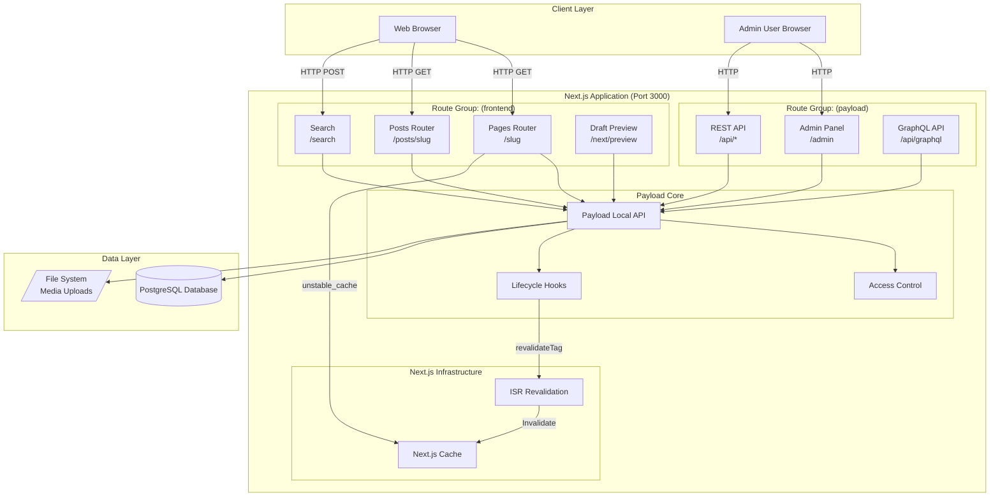
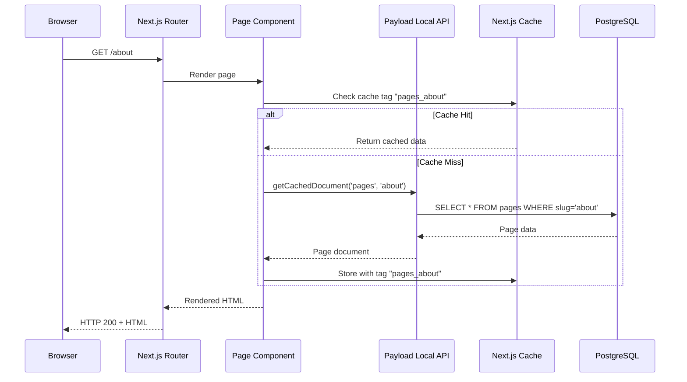
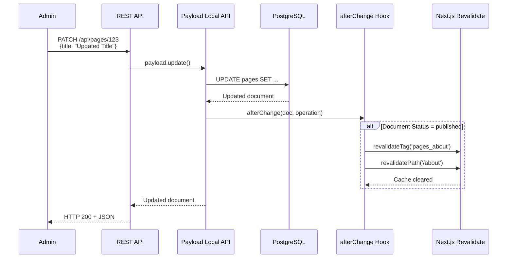
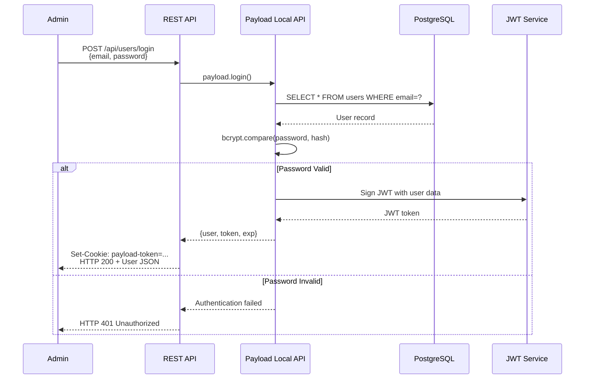
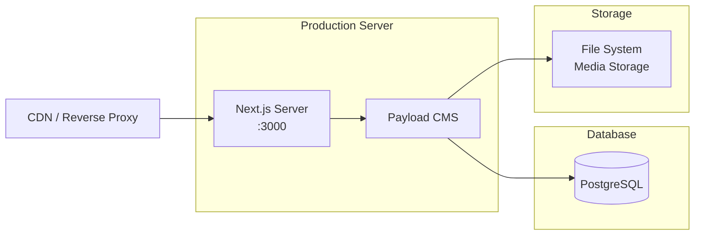

# Architecture Overview

## System Architecture

Payload HCE Website implements a **monolithic Next.js App Router architecture** where Payload CMS and the public frontend coexist in a single application. This design prioritizes deployment simplicity while maintaining clear separation of concerns through Next.js route groups.

### Architectural Principles

1. **Single Deployment Unit**: Both CMS admin panel and public website deploy together
2. **Server-Side First**: Content fetching happens server-side using Payload Local API
3. **On-Demand Revalidation**: Static generation with selective cache invalidation
4. **Type-Safe End-to-End**: Generated types from database schema flow through entire stack

---

## High-Level Architecture Diagram



---

## Request Flow Patterns

### 1. Public Page Request (SSR with Caching)



### 2. Content Update Flow (Admin → Revalidation)



### 3. Authentication Flow



---

## Component Organization

### Directory Structure

```
src/
├── app/
│   ├── (frontend)/          # Public website routes
│   │   ├── [slug]/          # Dynamic pages
│   │   ├── posts/           # Blog section
│   │   ├── search/          # Search functionality
│   │   ├── next/            # Next.js utilities (preview, seed)
│   │   └── layout.tsx       # Frontend layout
│   │
│   └── (payload)/           # CMS backend routes
│       ├── admin/           # Admin UI (generated)
│       ├── api/             # REST & GraphQL APIs
│       │   ├── [...slug]/   # Payload catch-all route
│       │   ├── graphql/     # GraphQL endpoint
│       │   └── graphql-playground/
│       └── layout.tsx       # Admin layout
│
├── collections/             # Payload collection configs
│   ├── Pages/
│   │   ├── index.ts         # Collection schema
│   │   └── hooks/           # Collection-specific hooks
│   ├── Posts/
│   ├── Media.ts
│   ├── Categories.ts
│   └── Users/
│
├── blocks/                  # Layout builder blocks
│   ├── ArchiveBlock/
│   ├── CallToAction/
│   ├── Content/
│   └── MediaBlock/
│
├── access/                  # Access control functions
│   ├── authenticated.ts
│   └── authenticatedOrPublished.ts
│
├── hooks/                   # Global hooks
│   ├── revalidateRedirects.ts
│   └── populatePublishedAt.ts
│
├── utilities/               # Shared utilities
│   ├── getDocument.ts       # Cached document fetching
│   ├── getGlobals.ts        # Global data fetching
│   └── generatePreviewPath.ts
│
├── plugins/                 # Payload plugin configuration
│   └── index.ts             # SEO, Search, Redirects, etc.
│
├── fields/                  # Reusable field configs
│   └── defaultLexical.ts    # Lexical editor config
│
└── payload.config.ts        # Main Payload configuration
```

### Separation of Concerns

**Route Groups** provide logical separation without affecting URL structure:

- `(frontend)/*` → Public-facing routes, server-rendered pages
- `(payload)/*` → Admin panel and APIs, requires authentication

**Data Fetching Strategy**:
- Frontend uses **Payload Local API** (server-side only)
- Admin uses **REST API** (client-side HTTP calls)
- Never expose Local API to browser client

---

## Deployment Model

### Single Server Deployment



**Deployment Steps**:
1. `pnpm build` - Builds Next.js app and Payload admin
2. `pnpm payload migrate` - Runs pending database migrations
3. `pnpm start` - Starts production server

**Environment Requirements**:
- Node.js ≥20.9.0
- PostgreSQL database
- Persistent file storage for media uploads
- Environment variables configured (see `.env.example`)

### Vercel Deployment Option

Alternatively, deploy to Vercel with:
- Vercel Postgres adapter: `@payloadcms/db-vercel-postgres`
- Vercel Blob Storage: `@payloadcms/storage-vercel-blob`
- Cron jobs for scheduled publishing (limited to daily on free tier)

---

## Decision History & Trade-offs

### Why Monolithic Architecture?

**Decision**: Combine CMS and frontend in single Next.js application.

**Rationale**:
- **Deployment Simplicity**: Single build, single deployment target
- **Performance**: No network latency between CMS and frontend (Local API)
- **Type Safety**: Shared TypeScript types across admin and frontend
- **Cost**: One server to maintain vs. separate frontend/backend

**Trade-offs**:
- Less flexibility to scale admin and frontend independently
- Admin panel and public site share same resource pool
- Requires careful route organization to avoid conflicts

**Mitigation**:
- Route groups provide clear separation
- Access control prevents public access to admin resources
- Can migrate to separate deployments later if needed

### Why PostgreSQL Over MongoDB?

**Decision**: Use PostgreSQL as primary database.

**Rationale**:
- **Schema Enforcement**: Relational model matches CMS collection structure
- **ACID Compliance**: Critical for content versioning and draft workflow
- **Ecosystem**: Better tooling for migrations, backups, query analysis
- **Performance**: Efficient joins for related content (posts → categories)

**Trade-offs**:
- Requires explicit migrations for schema changes in production
- Slightly more complex setup than MongoDB
- Less flexible for highly dynamic schemas

**Mitigation**:
- Local development uses `push: true` for auto-migration
- Migration workflow documented and automated
- Payload's ORM abstracts most SQL complexity

### Why On-Demand ISR Over Full SSR?

**Decision**: Use Incremental Static Regeneration with on-demand revalidation.

**Rationale**:
- **Performance**: Static pages served from cache (fast TTFB)
- **Freshness**: Revalidate only when content changes (not time-based)
- **Cost**: Reduced database queries for frequently accessed pages
- **SEO**: Consistent, fast page loads improve rankings

**Trade-offs**:
- More complex cache invalidation logic
- Potential for stale content if revalidation fails
- Requires understanding of Next.js caching behavior

**Mitigation**:
- Revalidation hooks trigger automatically on publish
- Cache tags enable granular invalidation
- Fallback to SSR if cache errors occur

---

## Performance Characteristics

### Expected Performance Metrics

| Metric | Target | Measurement |
|--------|--------|-------------|
| TTFB (Cached Page) | < 100ms | First byte received |
| TTFB (Uncached Page) | < 500ms | Includes DB query + render |
| Admin API Response | < 200ms | Simple CRUD operations |
| Admin API (Complex) | < 1000ms | Queries with deep population |
| Build Time | < 3 min | Full production build |
| Type Generation | < 10s | `pnpm generate:types` |

### Optimization Strategies

1. **Database Indexing**: Slug fields indexed for fast lookups
2. **Image Optimization**: Sharp generates responsive image sizes
3. **Code Splitting**: Next.js automatic route-based splitting
4. **Cache Strategy**: `unstable_cache` with granular tags
5. **Lazy Loading**: Admin panel components loaded on demand

---

## Next Steps

- Review [Dependencies](./dependencies.md) for Payload injection patterns
- Review [Patterns](./patterns.md) for code organization and error handling
- See [Database Schema](../database/schema.md) for data model details
