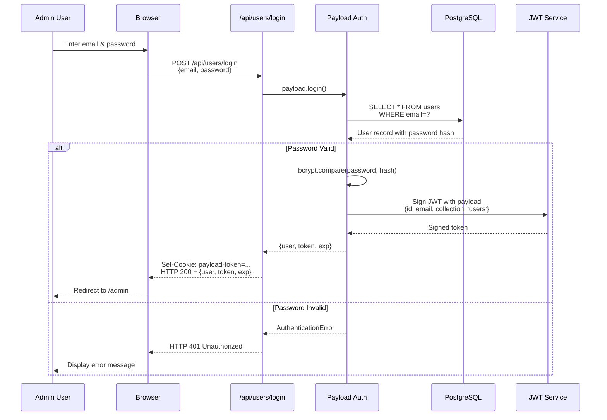
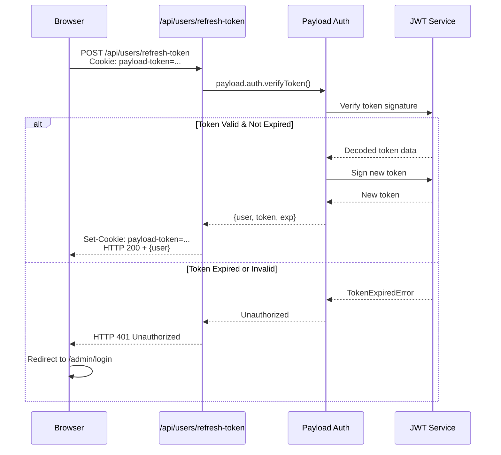
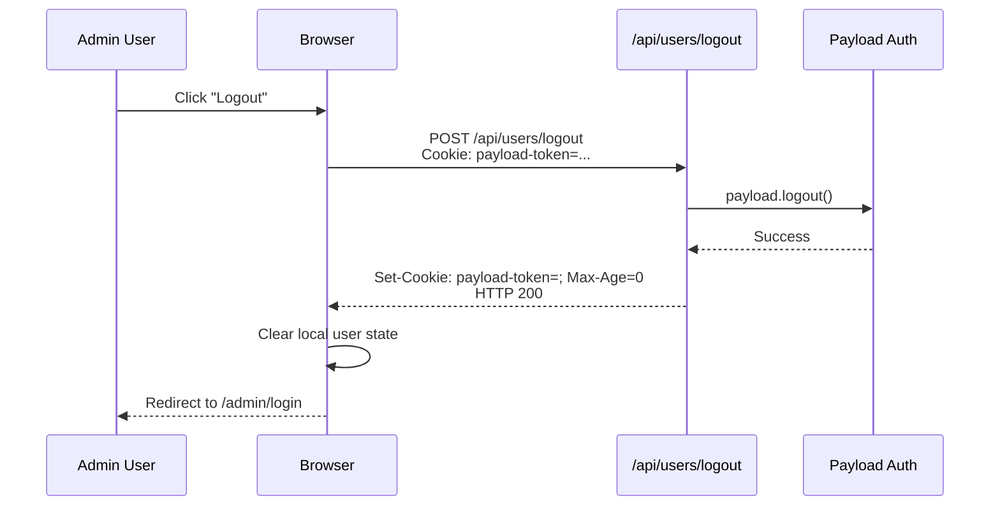

# Authentication Overview

## Authentication System

Payload HCE Website uses **Payload's built-in JWT-based authentication** system. Authentication is collection-based—any collection can be auth-enabled by setting `auth: true`. This project uses a dedicated `Users` collection for authentication.

### Core Authentication Features

- **JWT Tokens**: Stateless authentication with signed JSON Web Tokens
- **HTTP-Only Cookies**: Secure token storage prevents XSS attacks
- **Password Hashing**: bcrypt with configurable salt rounds
- **Email Verification**: Optional email verification workflow
- **Password Reset**: Built-in forgot password flow
- **Refresh Tokens**: Automatic token refresh on API requests

---

## Authentication Flow

### Login Flow



### Token Refresh Flow



### Logout Flow



---

## Users Collection Configuration

**Implementation** (`src/collections/Users/index.ts`):

```typescript
import type { CollectionConfig } from 'payload'
import { authenticated } from '@/access/authenticated'

export const Users: CollectionConfig = {
  slug: 'users',
  auth: true,  // Enable authentication for this collection
  access: {
    // Only authenticated users can perform any operation
    admin: authenticated,
    create: authenticated,
    delete: authenticated,
    read: authenticated,
    update: authenticated,
  },
  admin: {
    defaultColumns: ['name', 'email'],
    useAsTitle: 'name',
  },
  fields: [
    {
      name: 'name',
      type: 'text',
      required: false,  // Name is optional
    },
  ],
  timestamps: true,  // Adds createdAt and updatedAt
}
```

**Built-In Fields** (auto-added by `auth: true`):
- `email` (string, unique, required) - User's email address
- `password` (string, required) - Hashed password (bcrypt)
- `loginAttempts` (number) - Failed login counter for lockout
- `lockUntil` (date) - Account lock expiration

---

## Session Management

### JWT Token Structure

```json
{
  "id": "507f1f77bcf86cd799439011",
  "collection": "users",
  "email": "admin@example.com",
  "iat": 1700000000,
  "exp": 1700086400
}
```

**Token Properties**:
- **id**: User's database ID
- **collection**: Always `"users"` for this project
- **email**: User's email address
- **iat** (Issued At): Unix timestamp of token creation
- **exp** (Expiration): Unix timestamp when token expires (default: 7 days)

### Cookie Configuration

**Cookie Name**: `payload-token`

**Cookie Attributes**:
```http
Set-Cookie: payload-token=eyJhbGciOiJIUzI1NiIsInR5cCI6IkpXVCJ9...;
  HttpOnly;
  Secure;
  SameSite=Lax;
  Path=/;
  Max-Age=604800
```

- **HttpOnly**: Prevents JavaScript access (XSS protection)
- **Secure**: Only sent over HTTPS in production
- **SameSite=Lax**: CSRF protection while allowing external navigation
- **Max-Age**: 7 days (604800 seconds)

---

## Authentication API Endpoints

### POST /api/users/login

**Request**:
```typescript
POST /api/users/login
Content-Type: application/json

{
  "email": "admin@example.com",
  "password": "SecurePassword123!"
}
```

**Success Response** (200):
```json
{
  "message": "Logged in successfully",
  "user": {
    "id": "507f1f77bcf86cd799439011",
    "email": "admin@example.com",
    "name": "Admin User",
    "collection": "users"
  },
  "token": "eyJhbGciOiJIUzI1NiIsInR5cCI6IkpXVCJ9...",
  "exp": 1700086400
}
```

**Error Response** (401):
```json
{
  "errors": [
    {
      "message": "The email or password provided is incorrect."
    }
  ]
}
```

---

### POST /api/users/logout

**Request**:
```typescript
POST /api/users/logout
Cookie: payload-token=eyJhbGciOiJIUzI1NiIsInR5cCI6IkpXVCJ9...
```

**Success Response** (200):
```json
{
  "message": "You have been logged out successfully."
}
```

---

### POST /api/users/refresh-token

**Request**:
```typescript
POST /api/users/refresh-token
Cookie: payload-token=eyJhbGciOiJIUzI1NiIsInR5cCI6IkpXVCJ9...
```

**Success Response** (200):
```json
{
  "user": {
    "id": "507f1f77bcf86cd799439011",
    "email": "admin@example.com",
    "name": "Admin User"
  },
  "token": "eyJhbGciOiJIUzI1NiIsInR5cCI6IkpXVCJ9...",
  "exp": 1700086400
}
```

---

### POST /api/users/forgot-password

**Request**:
```typescript
POST /api/users/forgot-password
Content-Type: application/json

{
  "email": "admin@example.com"
}
```

**Success Response** (200):
```json
{
  "message": "If an account with that email exists, a password reset link has been sent."
}
```

**Implementation**:
- Generates a secure reset token
- Sends email with reset link (requires email configuration)
- Token expires after 1 hour

---

### POST /api/users/reset-password

**Request**:
```typescript
POST /api/users/reset-password
Content-Type: application/json

{
  "token": "abc123def456...",
  "password": "NewSecurePassword123!"
}
```

**Success Response** (200):
```json
{
  "message": "Password has been reset successfully."
}
```

---

## Server-Side Authentication

### Getting Current User in Server Components

```typescript
import { getMeUser } from '@/utilities/getMeUser'

export default async function AdminPage() {
  const user = await getMeUser()

  if (!user) {
    redirect('/admin/login')
  }

  return (
    <div>
      <h1>Welcome, {user.name || user.email}</h1>
    </div>
  )
}
```

**Implementation** (`src/utilities/getMeUser.ts`):

```typescript
import { cookies } from 'next/headers'
import { getPayload } from 'payload'
import configPromise from '@payload-config'

export async function getMeUser() {
  const payload = await getPayload({ config: configPromise })
  const cookieStore = cookies()
  const token = cookieStore.get('payload-token')?.value

  if (!token) {
    return null
  }

  try {
    const { user } = await payload.auth.verifyEmail({
      collection: 'users',
      token,
    })

    return user
  } catch (error) {
    return null
  }
}
```

---

### Access Control with User Context

```typescript
import { getPayload } from 'payload'
import configPromise from '@payload-config'
import { getMeUser } from '@/utilities/getMeUser'

export async function getUserPosts() {
  const payload = await getPayload({ config: configPromise })
  const user = await getMeUser()

  // Query with user context (enforces access control)
  const posts = await payload.find({
    collection: 'posts',
    user,  // Access control applied based on user
    where: {
      _status: { equals: 'draft' },  // Only accessible by authenticated users
    },
  })

  return posts.docs
}
```

---

## Client-Side Authentication

### React Hook for User State

```typescript
'use client'

import { useEffect, useState } from 'react'
import type { User } from '@/payload-types'

export function useAuth() {
  const [user, setUser] = useState<User | null>(null)
  const [loading, setLoading] = useState(true)

  useEffect(() => {
    async function fetchUser() {
      try {
        const response = await fetch('/api/users/me', {
          credentials: 'include',  // Include cookies
        })

        if (response.ok) {
          const data = await response.json()
          setUser(data.user)
        } else {
          setUser(null)
        }
      } catch (error) {
        console.error('Failed to fetch user:', error)
        setUser(null)
      } finally {
        setLoading(false)
      }
    }

    fetchUser()
  }, [])

  return { user, loading }
}
```

**Usage**:

```typescript
'use client'

import { useAuth } from '@/hooks/useAuth'
import { useRouter } from 'next/navigation'

export default function ProtectedPage() {
  const { user, loading } = useAuth()
  const router = useRouter()

  useEffect(() => {
    if (!loading && !user) {
      router.push('/admin/login')
    }
  }, [user, loading, router])

  if (loading) {
    return <div>Loading...</div>
  }

  if (!user) {
    return null
  }

  return <div>Protected content for {user.email}</div>
}
```

---

## Password Security

### Password Requirements

Payload enforces strong password policies by default:

- Minimum length: 8 characters
- Must contain uppercase and lowercase letters
- Must contain numbers
- Special characters recommended

**Custom Password Validation**:

```typescript
export const Users: CollectionConfig = {
  slug: 'users',
  auth: {
    verify: false,  // Disable email verification
    maxLoginAttempts: 5,  // Lock account after 5 failed attempts
    lockTime: 600000,  // Lock for 10 minutes (in ms)
    useAPIKey: false,  // Disable API key authentication
    depth: 0,
    cookies: {
      secure: process.env.NODE_ENV === 'production',
      sameSite: 'lax',
      domain: undefined,  // Use default (current domain)
    },
  },
  fields: [
    // Custom fields...
  ],
}
```

### Password Hashing

Payload uses **bcrypt** with salt rounds = 10:

```typescript
// Automatically handled by Payload
import bcrypt from 'bcrypt'

const saltRounds = 10
const hashedPassword = await bcrypt.hash(plainPassword, saltRounds)

// Verification
const isValid = await bcrypt.compare(plainPassword, hashedPassword)
```

---

## Decision History & Trade-offs

### Why JWT Over Session Cookies?

**Decision**: Use JWT-based authentication instead of session store.

**Rationale**:
- **Stateless**: No session storage required (Redis, database)
- **Scalability**: Easy to scale horizontally
- **Performance**: No session lookup on every request
- **Simplicity**: Built into Payload, no additional infrastructure

**Trade-offs**:
- Cannot invalidate tokens before expiration (logout only clears cookie)
- Token contains user data (larger cookie size)
- Requires secret management (PAYLOAD_SECRET)

**Mitigation**:
- Short token expiration (7 days)
- Secure cookie settings (HttpOnly, Secure, SameSite)
- Token refresh mechanism for active users

### Why Collection-Based Auth?

**Decision**: Use Payload collections for user management vs. external auth provider.

**Rationale**:
- **Integration**: Seamless with Payload admin UI
- **Flexibility**: Full control over user fields and access logic
- **Simplicity**: No external dependencies or OAuth flows
- **Cost**: No third-party auth service fees

**Trade-offs**:
- No social login (Google, GitHub, etc.)
- Must implement password reset, email verification
- Self-hosted user database

**Mitigation**:
- Payload provides forgot password flow out of the box
- Can integrate OAuth plugins if needed later
- Clear documentation for email setup

---

## Next Steps

- Review [Auth Integration](./integration.md) for Next.js middleware patterns
- See [Auth Security](./security.md) for threat model and mitigations
- Review [Access Control](../architecture/patterns.md#access-control-patterns) for authorization patterns
